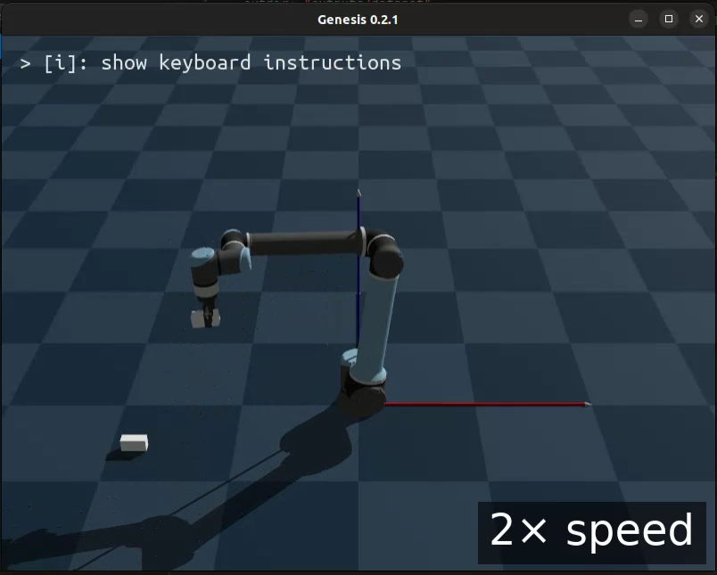

# Generate-rerun-dataset-from-UR10e-Robotiq-using-Genesis-Sim

(Click image below to watch the video demo.)

<a href="https://youtu.be/QQWXPEXPVyE">
  
</a>


## Installation

Before installing the packages, create and activate a Python 3.11 virtual environment using conda:

```bash
conda create -n genesis-sim-env python=3.11
conda activate genesis-sim-env
```

To set up the required Python packages, follow these steps **in order**:

1. Install `torch` basd on your CUDA version. It's required by Genesis.

2. Install `genesis-world`:
    ```bash
    pip install genesis-world
    ```

3. Install `rerun-sdk`:
    ```bash
    pip install rerun-sdk
    ```

4. Reinstall `tetgen` (required by genesis, may be affected by rerun):
    ```bash
    pip install --force-reinstall --no-cache-dir --no-build-isolation --upgrade --no-deps tetgen
    ```

5. Reinstall a compatible version of `numpy` (rerun may install an incompatible version):
    ```bash
    pip install "numpy<2.0" --force-reinstall
    ```
6. Install Yaml.
    ```bash
    pip install pyyaml
    ```

### Library Versions

| Library        | Version      |
| -------------- | ----------- |
| `rerun-sdk`    | 0.24.1      |
| `genesis-world`| 0.2.1       |
| `numpy`        | 1.26.4      |
| `tetgen`       | 0.6.7       |
| `torch`        | 2.6.0+cu124 |
| `pyyaml`        | 6.0.2       |


> **Note:**  
> The order is important. Installing `rerun-sdk` may install versions of `numpy` and `tetgen` that are incompatible with `genesis-world`. The last two steps ensure the correct versions are used.

## Generate and view Rerun dataset

To run this project:

1. **Start data capture**  
    Run the following command to start capturing data. This will save a rerun dataset in the `outputs/dataset` directory. If you use the default settings, you'll see a Genesis window rendering the world and activities.

    ```bash
    python src/run_capture.py
    ```

2. **View the generated dataset**  
    Use the rerun viewer to open the generated `.rrd` file. Replace `PATH/TO/GENERATE_DATA_FILE.rrd` with the actual path to your file:

    ```bash
    rerun viewer PATH/TO/GENERATE_DATA_FILE.rrd
    ```

    To quickly view the most recently recorded rerun file, use:

    ```bash
    rerun viewer $(ls -t outputs/dataset/*.rrd | head -n 1)
    ```

## Logged Streams

Synchronization isn't a problem since the camera and the robot states measurements have the same clock. The following data streams are recorded:

- **Robot State**
  - `robot/state/q`: Joint positions (q)
  - `robot/state/dq`: Joint velocities (dq)

- **Commands**
  - `commands/q_target`: Target joint positions (commands sent to the robot)

- **Gripper State**
  - `gripper/state/is_closed`: Gripper status (0.0 = open, 1.0 = closed)

- **End-Effector (EE) Pose**
  - `world/ee`: End-effector pose in world frame, logged as `Transform3D` with translation and quaternion rotation.

- **Camera Stream**
  - `cam/rgb`: RGB images from the simulated camera (~30 Hz).

- The logger synchronizes all streams with simulation time (`sim_time`).

### Demo of rerun dataset analysis
<p align="center">
  
</p>

The animation above demonstrates the rerun dataset analysis. It shows:

- _[Left]_ The RGB image stream `/cam/rgb` from the camera mounted on the robot.
- _[Upper Right]_ The Joint positions measurements `/robot/state/q` for each degree of freedom (DOF) of the robot arm. **The smooth transition of the colors indicate that the robot joints move smoothly.**
- _[Lower Right]_ The Gripper's open/close status `/gripper/state/is_closed`, indicating whether the Gripper is open or close. **The Yellow status indicates that the Gripper is closed and the Purple status indicates that the Gripper is open. Focus on the image and watch the color changing as the open/close command is send to the Gripper.**

## Improvements
- Improve Robot initial rapid movement.
- Improve planning by making it independent of predefined time boundary.
- Add automated Language Task generation based on the events used for path planning.
- Move hard coded params to config.
- Improve code structure.
- Add Docker. Add requirements.txt or Poetry.

## Resources
- [UR10e robot xml](https://github.com/google-deepmind/mujoco_menagerie/tree/main/universal_robots_ur10e)
- [Robotiq 2F-85](https://github.com/google-deepmind/mujoco_menagerie/blob/main/robotiq_2f85/README.md)
- [Example UR10e + Robotiq 2F-85](https://github.com/google-deepmind/mujoco_menagerie/issues/37#issuecomment-1862723050)

## References
[1] [mujoco_menagerie](https://github.com/google-deepmind/mujoco_menagerie)

[2] [Genesis](https://genesis-embodied-ai.github.io/)